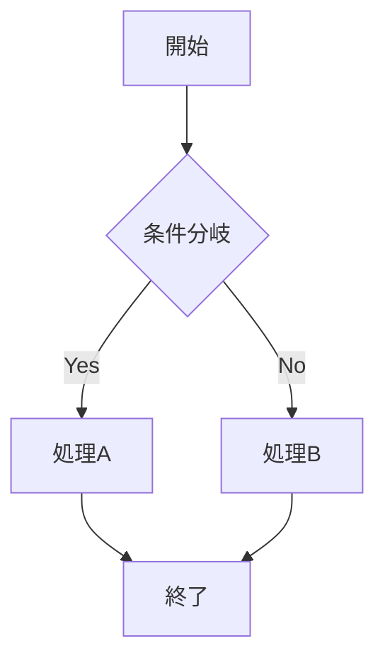
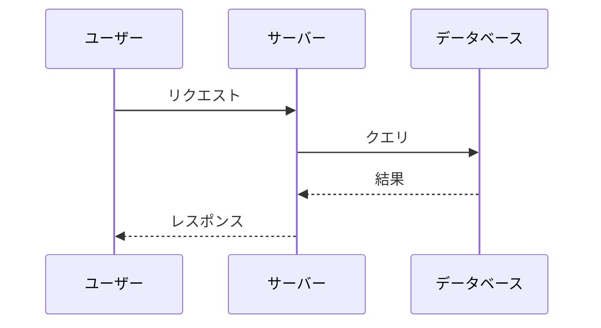

# Rich Markdown Preview テスト用ドキュメント

このファイルは Rich Markdown Preview の各機能を検証するためのテスト用Markdownです。

---

## 見出しレベルテスト

# H1 見出し
## H2 見出し
### H3 見出し
#### H4 見出し
##### H5 見出し
###### H6 見出し

---

## テキスト装飾

**太字テキスト** と *イタリックテキスト* と ~~取り消し線~~

***太字イタリック*** もサポートされています。

---

## リンク

- [GitHub](https://github.com)
- https://example.com （自動リンク）

---

## リスト

### 順序なしリスト
- 項目1
- 項目2
  - ネスト項目2-1
  - ネスト項目2-2
    - 深いネスト
- 項目3

### 順序付きリスト
1. 最初の項目
2. 二番目の項目
3. 三番目の項目

---

## タスクリスト

- [x] 完了したタスク
- [x] これも完了
- [ ] 未完了のタスク
- [ ] もう一つの未完了タスク

---

## テーブル

| 名前 | 年齢 | 職業 |
|------|------|------|
| 田中太郎 | 30 | エンジニア |
| 佐藤花子 | 25 | デザイナー |
| 鈴木一郎 | 35 | マネージャー |

---

## 引用

> これは引用テキストです。
> 複数行にわたる引用もサポートされています。

> ネストされた引用
>> 二重の引用もできます。

---

## コードブロック

### JavaScript
```javascript
function greet(name) {
  console.log(`Hello, ${name}!`);
  return { greeting: `Hello, ${name}!`, timestamp: Date.now() };
}

const result = greet('World');
```

### Python
```python
def fibonacci(n):
    if n <= 1:
        return n
    return fibonacci(n - 1) + fibonacci(n - 2)

for i in range(10):
    print(f"F({i}) = {fibonacci(i)}")
```

### TypeScript
```typescript
interface User {
  id: number;
  name: string;
  email: string;
}

const getUser = async (id: number): Promise<User> => {
  const response = await fetch(`/api/users/${id}`);
  return response.json();
};
```

### インラインコード

`console.log()` や `npm install` のようなインラインコードもサポートしています。

---

## Mermaidダイアグラム

### フローチャート


### シーケンス図


---

## 脚注

これは脚注の参照です[^1]。もう一つの脚注もあります[^2]。

[^1]: これは最初の脚注の内容です。
[^2]: これは二番目の脚注の内容です。

---

## 絵文字ショートコード

:smile: :rocket: :heart: :thumbsup: :star: :fire: :tada:

日本語テキストと絵文字の組み合わせ：お疲れ様です :clap:

---

## 画像


---

## 水平線

上のテキスト

---

下のテキスト

---

## 折りたたみ要素

<details>
<summary>クリックで展開</summary>

これは折りたたまれたコンテンツです。

- 項目A
- 項目B
- 項目C

</details>

<details>
<summary>コードを表示</summary>

```javascript
const secret = "折りたたみの中のコード";
console.log(secret);
```

</details>

---

## 長いテキスト（スクロールテスト用）

Lorem ipsum dolor sit amet, consectetur adipiscing elit. Sed do eiusmod tempor incididunt ut labore et dolore magna aliqua.

日本語の長いテキストです。これはスクロール動作と目次のスクロール同期をテストするためのセクションです。十分な長さのテキストが必要なため、繰り返し記述しています。

段落1: Rich Markdown Preview は、ローカルの Markdown ファイルを美しくプレビューするための Chrome 拡張機能です。25種類以上のテーマ、日本語フォント対応、フォルダ管理機能を備えています。

段落2: エディタで保存すると1秒以内にプレビューが自動更新されるため、VS Code や Vim と組み合わせて使うのに最適です。

段落3: 目次の自動生成機能により、長い文書でも目的の箇所にすぐにジャンプできます。スクロール位置に応じて現在の見出しがリアルタイムでハイライトされます。

---

## 検索テスト用テキスト

以下のテキストには「テスト」という単語が複数回含まれています：

- テスト項目1: 最初のテスト
- テスト項目2: 二番目のテスト
- テスト項目3: 三番目のテスト
- テスト項目4: 四番目のテスト
- テスト項目5: 五番目のテスト

「検索」という単語も使用しています。検索機能のテストです。検索バーに入力してください。

---

## 最後のセクション

このドキュメントの末尾です。目次から各セクションにジャンプできることを確認してください。
